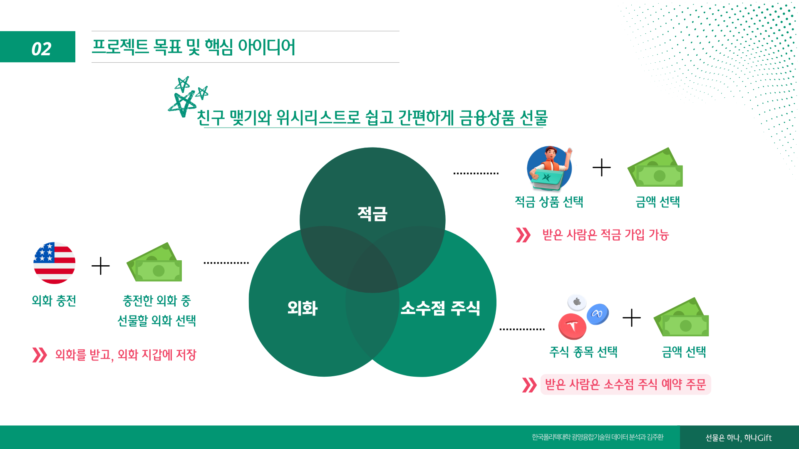

# 금융 상품 선물하기 서비스 - 하나 Gift

### 1. 프로젝트 소개

**목표**

> 쉽고 간편하게 스며드는 금융상품 선물하기 서비스

### 2. 프로젝트 개요

-   사례1. 현재 선물하기 시장이 10조원 규모로 성장하고 있고, 이때 주로 이용 고객의 50%가 2030세대입니다.
-   사레2 - 현재 소수점 주식 사용량이 증가하고 있으며, 2030 세대가 주로 이용 고객입니다. 주식에 대한 니즈가 높고 선물하기가 친숙한 2030세대를 위한 선물하기 서비스를 기획하게 되었습니다.
    **적금에 대한 니즈와 해외 여행 증가에 맞춰 주식, 적금, 외화를 선물할 수 있는 서비스를 개발**
    **선물받기를 통한 신규 고객 유입을 목표로 합니다.**

### 3. 핵심 아이디어

-   적금 선물하기: 적금 상품과 금액을 선택해서 선물하면, 받는 사람은 해당 금액으로 적금에 가입할 수 있습니다.
-   외화 선물하기: 실시간 환율을 기반으로 외화를 충전한 다음, 충전한 외화를 선물할 수 있습니다.
-   주식 선물하기: 소수점 주식을 선물하는 서비스입니다. 주식 종목과 금액을 선물할 수 있고, 받으면 해당 금액으로 해당 종목을 주문하게 됩니다.

### 4. 구현 기능

-   Spring Batch를 활용한 소수점 주식 예약 주문 프로세스
    
-   Llama3에 RAG(Retrieval-Augmented Generation)
    

### 5. 시스템 아키텍처

### 6. 본인 소개

| 구분      | 내용                                                       |                                비고 |
| --------- | ---------------------------------------------------------- | ----------------------------------: |
| 이름      | 김주환                                                     |  |
| 연락처    | 이메일                                                     |                 joy980721@gmail.com |
| Skill Set | Language                                                   |                   Java, Python, C++ |
|           | Framework                                                  |       Spring, Spring Batch, Flutter |
|           | DBMS                                                       |                       Oracle, MySQL |
|           | AI & Data                                                  |  LangChain, Tensorflow, Sckit Learn |
| 자격증    | 정보처리기사                                               |                          2024.09.10 |
|           | ADsP                                                       |                          2024.03.22 |
|           | AICE ASSOCIATE                                             |                          2023.04.21 |
|           | SQLD                                                       |                          2022.09.30 |
|           | ISTQB                                                      |                          2022.08.24 |
| 수상      | 제 4회 K-디지털 트레이닝 해커톤 대상(고용노동부장관상)     |                          2023.06.28 |
|           | 2022 교내 SW Festival 스마트 어플리케이션 공모전 장려상    |                          2022.10.14 |
|           | 2022 교내 캡스톤 디자인 우수상, JOK(Journal of KIISE) 게재 |                          2022.06.13 |
| 교육      | 하나금융티아이 채용연계형 교육                             |             2024.03.04 ~ 2024.10.18 |
|           | kt 에이블스쿨 AI 개발자                                    |             2023.01.31 ~ 2023.07.18 |
